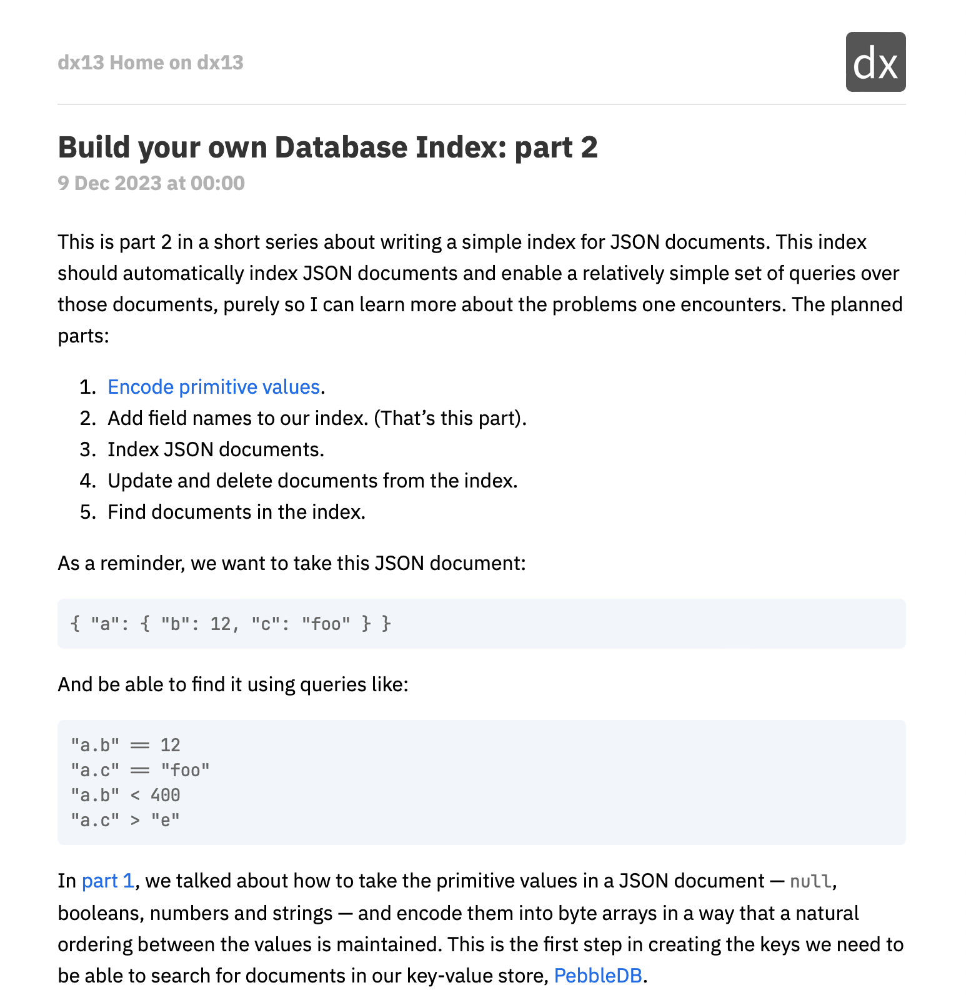

# nnw-allmine

This is a personal customisation of the default NetNewsWire theme. It alters the
fonts to a more Humanist style and sets the preferred code font to my favourite.

- Alter code block style to remove border and add background.
- Alter article and code font.
- Set either [IBM Plex Sans] or Seravek (built into iOS and macOS) as article
  font.
- Set [JetBrains Mono] as code font, if it's installed.

The screenshot shows both IBM Plex Sans and JetBrains Mono:



[IBM Plex Sans]: https://www.ibm.com/plex/
[JetBrains Mono]: https://www.jetbrains.com/lp/mono/

## Install

To copy to your NetNewsWire theme folder, you can either double click the theme
file (`Default-AllMine.nnwtheme`) or run:

```
make install
```
